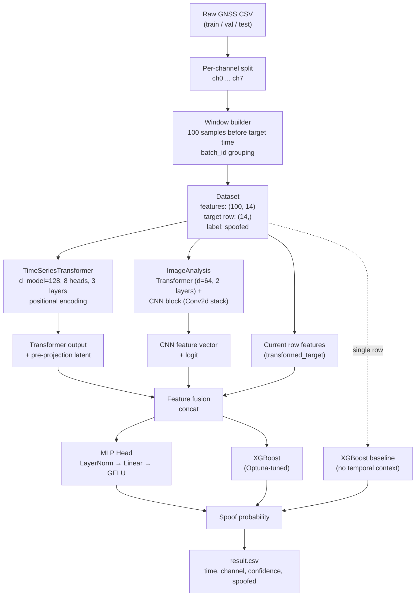
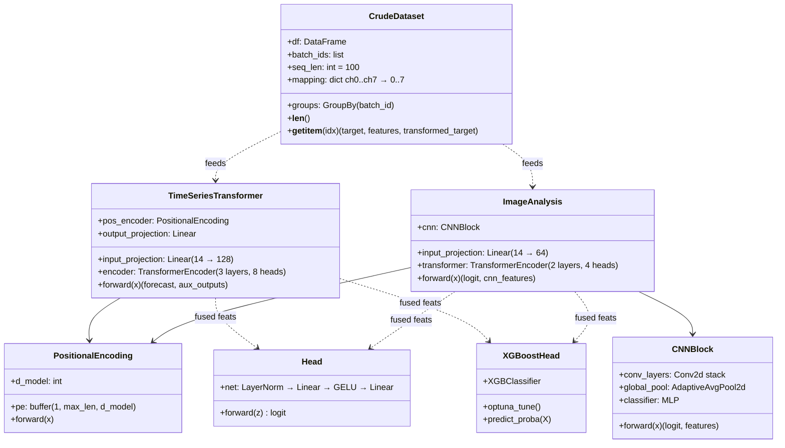

# GNSSGuard

GNSS spoofing detection from raw receiver observables.

GPS/GNSS receivers can be tricked. Someone rebroadcasts a stronger-than-real signal, the receiver locks onto it, and your position, time, or both quietly drift to whatever the attacker wants. GNSSGuard tries to catch that from the inside, using the tracking-loop observables the receiver already produces (carrier Doppler, pseudorange, correlator outputs, CN0, and friends) instead of trusting the final fix.

The setup is per-channel. Eight tracking channels (ch0–ch7), a 100-sample history window before every decision point, and a binary label per window: `spoofed` or not.

## What's in this repo

```
GNSSGuard/
├── code/
│   └── datapreprocessing.py        # per-channel split + 100-sample window builder
├── dataset/
│   ├── train.zip / val.zip / test.zip
│   └── result.csv                  # predictions: time, channel, confidence, spoofed
├── notebook/
│   ├── p1.ipynb ... p7.ipynb       # exploration, per-stage training
│   ├── final_.ipynb                # end-to-end fusion model + XGB head
│   ├── resulting.ipynb             # test-set inference → result.csv
│   ├── hb.ipynb, p1_1.ipynb
│   ├── best_model.pth              # fused transformer + CNN + head checkpoint
│   ├── best_model_6.pth            # transformer-only checkpoint (forecast pretrain)
│   ├── best_cnn_model.pth          # image-analysis CNN checkpoint
│   ├── best_cnn_model_p5.pth
│   ├── finetuned_with_head.pth     # transformer + classifier head
│   ├── xgb_single_row_model.pkl    # snapshot-only XGBoost baseline
│   ├── transformer_model_xgb.pkl   # XGB over transformer features
│   ├── image_model_xgb.pkl         # XGB over CNN features
│   └── training_curves*.png
├── LICENSE
└── README.md
```

## The data

Each row is one tracking-loop snapshot for one channel at one time. The features the pipeline consumes:

| Feature | What it is |
|---|---|
| `Carrier_Doppler_hz` | Doppler shift on the carrier |
| `Pseudorange_m` | Distance estimate to the satellite |
| `TOW` | Time of week from the nav message |
| `Carrier_phase` | Integrated carrier-phase measurement |
| `EC`, `LC`, `PC` | Early / Late / Prompt correlator magnitudes |
| `PIP`, `PQP` | In-phase and quadrature prompt correlator outputs |
| `TCD` | Tracking-channel status |
| `CN0` | Carrier-to-noise density |
| `PRN` | Satellite ID |
| `channel` | Tracking channel (ch0–ch7, mapped to 0–7) |
| `time` | Sample time (used for ordering, dropped before the model) |
| `spoofed` | Label (0 / 1) |

Rows where every observable is zero are treated as dead channel and filtered out before windowing. See `code/datapreprocessing.py`.

## Architecture

Two encoders read the same 100-sample window from opposite angles, and their features get fused and handed to a small head (or to XGBoost, whichever performs better on a given split).



### Class view



### What each piece is doing

Preprocessing (`code/datapreprocessing.py`) does the boring but load-bearing
work. Split by `channel`, sort by `time`, and for each target timestamp
grab the 100 samples that came before it. Every window gets stamped with a
`batch_id` so the downstream `groupby` is O(1). Rows where all observables
are exactly zero get dropped first, because those are tracking drop-outs
and they poison any model you train on them.

The `TimeSeriesTransformer` is a vanilla 3-layer encoder with sinusoidal
position embeddings. It's pretrained as a forecaster: predict the target
row's feature vector from the 100-sample history. What actually matters
downstream isn't the forecast itself but the 128-d latent just before the
output projection; that vector is what ends up in the fused feature.

The `ImageAnalysis` branch looks at the same window from a different
angle. We concatenate the target row onto the end so the model sees 101
rows × 14 features, then a smaller Transformer (`d_model=64`) shapes it
before a Conv2d stack treats the resulting matrix like an image. It ends
with global average pooling and spits out a 128-d feature plus a binary
logit.

The small `Head` is an MLP (`LayerNorm → Linear → GELU → Dropout → Linear
→ Linear`) trained with `BCEWithLogitsLoss` on the concatenated features
from both branches plus the current row.

XGBoost plays two roles. On the fused features it's the actual production
classifier, tuned with Optuna across 50 trials on macro-F1. Separately,
`xgb_single_row_model.pkl` is a no-context baseline that only sees the
current snapshot; it's there so we can tell whether the 100-sample window
is buying anything, and on well-behaved data it's more competitive than
you'd expect.

## Training pipeline

The notebooks are numbered roughly in the order things were built:

- `p1.ipynb`: raw data exploration, per-channel split, continuity checks.
- `p2.ipynb`: signal analysis (STFT, spectrograms) to sanity-check what spoofing looks like in PIP/PQP.
- `p3.ipynb`: TimeSeriesTransformer forecasting pretrain, head fine-tune, and transformer-features XGBoost.
- `p4.ipynb`: ImageAnalysis (Transformer + CNN) for binary spoofing.
- `p5.ipynb`: refined CNN training, Optuna XGBoost over CNN features.
- `p6.ipynb`: single-row XGBoost and RandomForest baselines (no windows, no embedding models). Saves `xgb_single_row_model.pkl`.
- `p7.ipynb`: loads both trained encoders, dumps fused features for XGBoost.
- `final_.ipynb`: joint fine-tune (transformer + CNN + head, 15 epochs), then fused-feature XGBoost with Optuna.
- `resulting.ipynb`: test-set inference. Writes `dataset/result.csv`.

Each training step either saves a `.pth` (neural checkpoints) or `.pkl` (XGBoost models) into `notebook/`.

## Running it

```bash
# 1. unzip the datasets
cd dataset && unzip train.zip && unzip val.zip && unzip test.zip && cd ..

# 2. build per-channel windowed CSVs into dataset/train and dataset/val
python code/datapreprocessing.py

# 3. step through the notebooks in numeric order,
#    or jump straight to final_.ipynb if the checkpoints are already there
jupyter lab notebook/
```

Dependencies are pinned in `requirements.txt` (`pip install -r requirements.txt`). Core stack: `torch`, `pandas`, `numpy`, `scikit-learn`, `xgboost`, `optuna`, `tqdm`, `matplotlib`, `scipy`. GPU is optional; the code falls back to CPU automatically.

For a stage-by-stage history of how the pipeline was built, see [`CHANGELOG.md`](CHANGELOG.md).

## Output

`dataset/result.csv` has one row per `(time, channel)`:

```
time,channel,confidence,spoofed
111402,0,0.13516198,0
111402,1,0.059740327,0
...
```

`confidence` is the fused model's probability of spoofing; `spoofed` is the thresholded label.

## Notes and caveats

- The train/val split is temporal, not random. Windows are sorted by time and the first 70% of each class goes to train. Random splits would leak, since the 100-sample windows overlap.
- Class balance is skewed toward non-spoofed. The notebooks report F1 and ROC-AUC rather than accuracy because of it.
- The single-row XGBoost does surprisingly well on its own. Most of the extra lift from the temporal models shows up on the harder, lower-CN0 segments, so it's worth checking whether the snapshot model already covers your use case before shipping the whole stack.

## License

MIT. See `LICENSE`.
